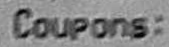
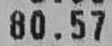

Implement fullflow of attention ocr using Tensorflow's seq2seq API and tf.estimator

# COCO Text dataset
[Here](https://vision.cornell.edu/se3/coco-text-2/)


# Source structure

| Location             |  Content                                   |
|----------------------|--------------------------------------------|
| `/data`              | Fonts file, character table and corpus     |
| `train.py        `   | Train script                               |
| `word_generator.py ` | Utility to generate synthetic word from corpus |
| `params.json ` | Configuration |
|'COCO-Text-words-trainval'| COCO text dataset for train and eval|

# Generated images from word corpus


# Train OCR model
```
E.g:
python train.py --model_dir ./model_dir/ --coco_path ./COCO-Text-words-trainval/
```

# Predict
Tensorflow serving is used to perform prediction for all models in this repo. Details of tensorflow serving is [here](https://www.tensorflow.org/tfx/guide/serving)

Firstly, we need to export the trained model to serving

```
python export.py --model_dir ./model_dir --export_dir ./serving/

```

Secondly, serve the model with docker, by default i only support restful api call

```
docker run -t --rm -p 8501:8501 -v "/home/nghi/ocr_attention/serving/:/models/ocr" -e MODEL_NAME=ocr tensorflow/serving &
```

# Serving model
[Here](https://drive.google.com/open?id=1PK0-JMpBauWNavccODbK1itbdzteg483)

# Prediction
Coupons.


999999502


80.57



